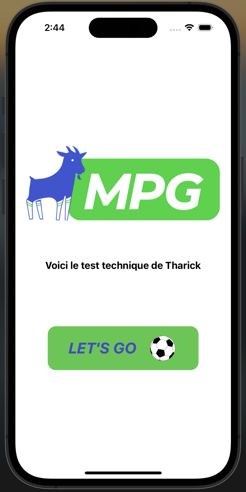

# MPGTechnicalTest

### Welcome to Tharick's technical test for the Front-end React/React Native (Junior) position at MPG.

#### This application consists of 3 pages

    
    
    

#### To launch the application, please enter the following commands :

- `npm install`
- `npm run start`

Then, all you have to do is choose the device on which you want to launch the app.